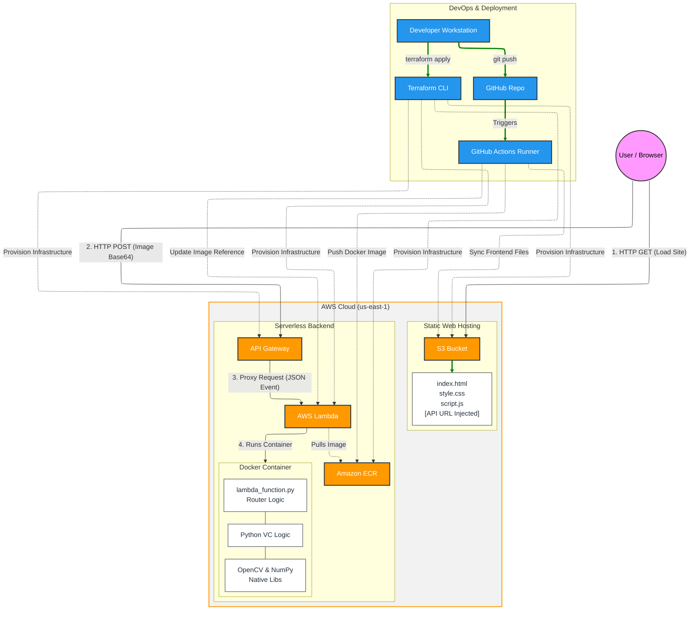

# Visual CryptograPY AWS Infrastructure

Distributed visual cryptography application hosted on AWS. All the visual cryptography functionalities are implemented using Python; more information about the visual cryptography library can be found [here](https://github.com/JeeYou02/visual_cryptograPY).

The whole infrastructure is built with terraform and updated through a Github Action triggered at each repository push.

Follows a detailed diagram of the whole infrastructure:

